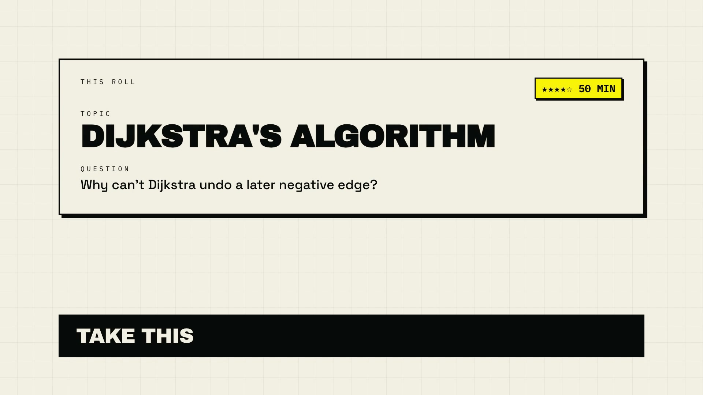

# ROLLDEEP

**You don't have a syllabus problem. You have a choosing problem.**

Free local study lab. Hit **ROLL**. Get one topic, one curiosity question, and a 25–60 minute window. Study however you want. Record a video so you actually did it. That topic never comes back.

No account. No cloud. MIT. Runs on your machine like Jupyter.

[](https://github.com/dev-the-dev-while-deving/rolldeep-lab/blob/main/brag-output/brag.mp4)

[Watch the 20-second demo](https://github.com/dev-the-dev-while-deving/rolldeep-lab/blob/main/brag-output/brag.mp4)

## Why this exists

Study apps sell choice: dashboards, playlists, “continue where you left off.” That is how you open Notion, pick the easy chapter, or pick nothing.

ROLLDEEP sells the opposite. The ROLL button is the product. You can reroll a few times. Then you TAKE one. Then you finish.

## Who it is for

- Students with a real syllabus who keep planning instead of starting
- Anyone who wants one locked-in deep-work block instead of a to-do list
- People who need proof they studied — a video is required to complete

## Start in one command

```bash
git clone https://github.com/dev-the-dev-while-deving/rolldeep-lab.git
cd rolldeep-lab
npm install
npm rebuild better-sqlite3
npm link
rolldeep
```

That opens the lab at [http://127.0.0.1:3210](http://127.0.0.1:3210). Same idea as `jupyter lab`. Aliases: `rolldeep lab`, `rolldeep notebook`.

Without a global link: `npx rolldeep`.

Runtime data stays in `~/.rolldeep/` (override with `ROLLDEEP_HOME`). The topic pool is files in this repo: `content/units/*.json`.

Ships with a CS2000 Design and Analysis of Algorithms pool. Drop your own syllabus in `content/syllabi/` and have an agent (or a human) write more units into `content/units/`.

## How a session works

1. Hit **ROLL** — up to 5 times. You see the current card plus 3 previous. TAKE one.
2. Study however you want. Make a short video so you actually did the work.
3. Complete with that proof URL. The topic is gone. Forever.

Each card shows **topic**, then **question**, hardness stars (1–5), and a time window. There is no study how-to in the UI. You already know how to study. You needed something that would not let you stall.

## The rules

- Up to 5 rolls per session; only current plus 3 previous stay visible
- TAKE one, then finish with proof
- Completed topics are excluded forever
- Topic name and curiosity question are both shown
- Local only — your work never leaves the machine

## Free, on purpose

ROLLDEEP is free software (MIT). No signup, no telemetry, no “pro” gate on the ROLL button. Fork it, load your syllabus, keep the streak.

If you want more units, add JSON. If you want an agent to operate it, the harness is first-class.

## For any AI model

Same lab. Three ways in:

| Path | How |
|---|---|
| Files | Edit `content/units/*.json`, then `rolldeep sync` |
| CLI | `rolldeep status` / `roll` / `choose` / `complete` |
| MCP | `rolldeep mcp` — or add the server from `.mcp.json` |

```bash
rolldeep status
rolldeep roll
rolldeep choose --id <id>
rolldeep complete --id <id> --url https://...
rolldeep sync
```

Grok:

```bash
grok mcp add rolldeep -- npx tsx mcp/server.ts
```

Claude Code / Cursor: this repo already has `.mcp.json`.

Read `SKILL.md` and `AGENTS.md`. Do not mint dummy “What is X?” questions. Author units into the JSON files.

## License

MIT
